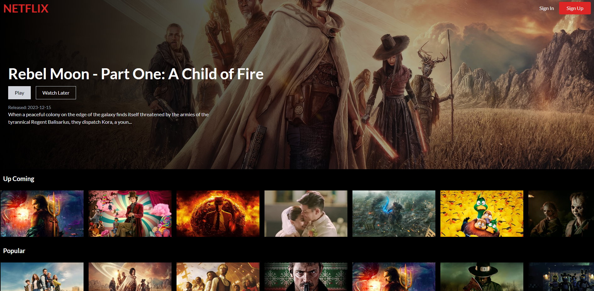
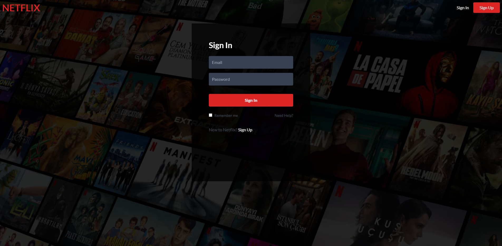
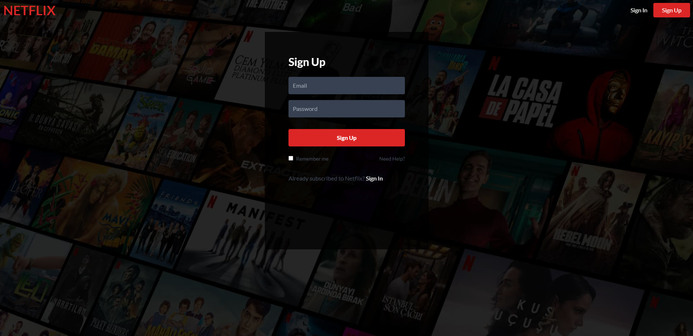
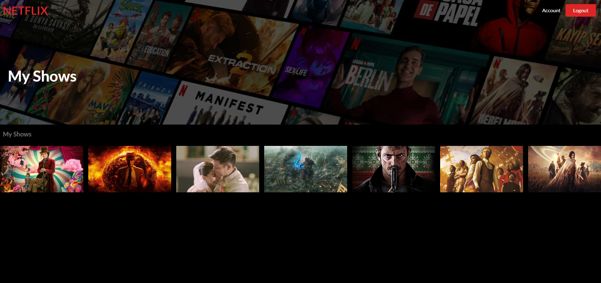

# Netflix Clone Project

#### HomePage

This project is a clone of the popular video streaming service, Netflix. This application was built using React and modern web technologies. Technologies such as Firebase and Tailwind CSS were also used.

Live Project

## Features

### Account Management

- Users can create a new account within the app.
- Users can close their accounts whenever they want.

### Registration

- Users can register for a new account within the app.

### Movie Liking

- Users can like the movies they have watched and enjoyed.
- Liked movies are listed on the user's account page.
- Users can select or remove the movies they like.

## Technologies

- React: React, a modern JavaScript library, forms the basis of this project.
- Firebase: Firebase provides services such as database and authentication in this project.
- Tailwind CSS: This project was stylized using Tailwind CSS.

## Installation

Follow these steps to install the project:

1. Clone the repo: `git clone https://github.com/cemkarakuss/netflix-clone.git`
2. Install dependencies: `npm install`
3. Start the app: `npm start`

## Contributing

This project is open source and your contributions are welcome. Please follow these steps to contribute:

1. Fork the repository
2. Create your feature or fix branch (`git checkout -b feature/fancyFeature`)
3. Commit your changes (`git commit -am 'Add some fancyFeature'`)
4. Push to your branch (`git push origin feature/fancyFeature`)
5. Create a new Pull Request

#### SignInPage

#### SignUpPage

#### AccountPage
