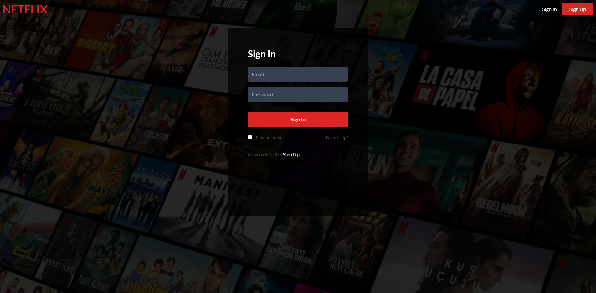
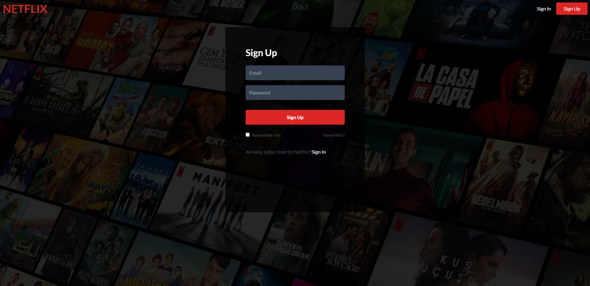

# Netflix Clone Projesi

#### HomePage

Bu proje, popüler video akışı hizmeti Netflix'in bir klonudur. Bu uygulama, React ve modern web teknolojileri kullanılarak oluşturulmuştur. Firebase ve Tailwind CSS gibi teknolojiler de kullanılmıştır.

[Canlı Proje](https://netflix-cloneblackbird-app.web.app/)

## Özellikler

### Hesap Yönetimi

- Kullanıcılar, uygulamada yeni bir hesap oluşturabilirler.
- Kullanıcılar, hesaplarını istedikleri zaman kapatabilirler.

### Kayıt Olma

- Kullanıcılar, uygulamada yeni bir hesap oluşturmak için kaydolabilirler.

### Film Beğenme

- Kullanıcılar, izledikleri ve beğendikleri filmleri beğenebilirler.
- Beğenilen filmler, kullanıcının hesap sayfasında listelenir.
- Kullanıcılar, beğendikleri filmleri seçebilir veya kaldırabilirler.

## Teknolojiler

- React: Modern bir JavaScript kütüphanesi olan React, bu projenin temelini oluşturur.
- Firebase: Firebase, bu projede veritabanı ve kimlik doğrulama gibi hizmetler sağlar.
- Tailwind CSS: Bu proje, Tailwind CSS kullanılarak stilize edilmiştir.

## Kurulum

Projenin kurulumu için aşağıdaki adımları izleyin:

1. Repoyu klonlayın: `git clone https://github.com/cemkarakuss/netflix-clone.git`
2. Bağımlılıkları yükleyin: `npm install`
3. Uygulamayı başlatın: `npm start`

## Katkıda Bulunma

Bu proje açık kaynaklıdır ve katkılarınıza açıktır. Katkıda bulunmak için lütfen aşağıdaki adımları izleyin:

1. Fork'layın
2. Özelliğinizi veya düzeltmenizi yaptığınız bir dal oluşturun (`git checkout -b feature/fancyFeature`)
3. Değişikliklerinizi işleyin (`git commit -am 'Add some fancyFeature'`)
4. Dalınıza itin (`git push origin feature/fancyFeature`)
5. Yeni bir Pull Request oluşturun

## Lisans

Bu proje MIT lisansı altında lisanslanmıştır.

#### SignInPage

#### SignUpPage

#### AccountPage
